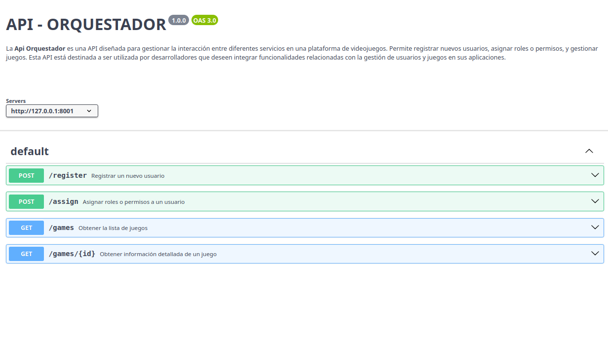
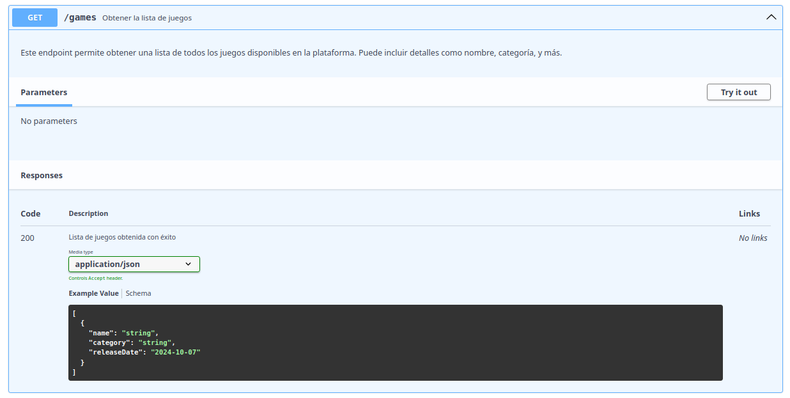

# api-documentation

# Documentación de API

Este repositorio contiene documentación visual para diversas APIs. A continuación se presentan las imágenes correspondientes a cada API, organizadas por carpeta.

## API Compañía

## API Juegos

## API Orquestador

## API Usuario

## Archivos JSON

Además, se incluyen los siguientes archivos JSON que describen las APIs:

- [api-compañia.json](src/api-compañia.json)
- [api-juegos.json](src/api-juegos.json)
- [api-orquestador.json](src/api-orquestador.json)
- [api-user.json](src/api-user.json)

